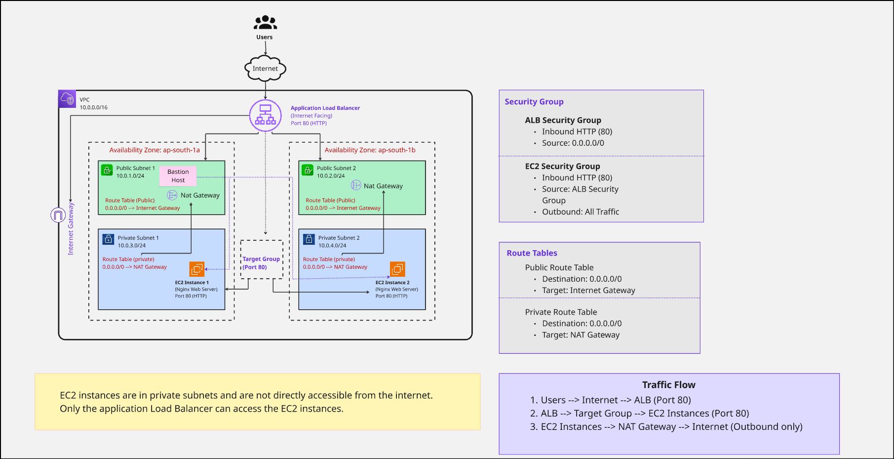
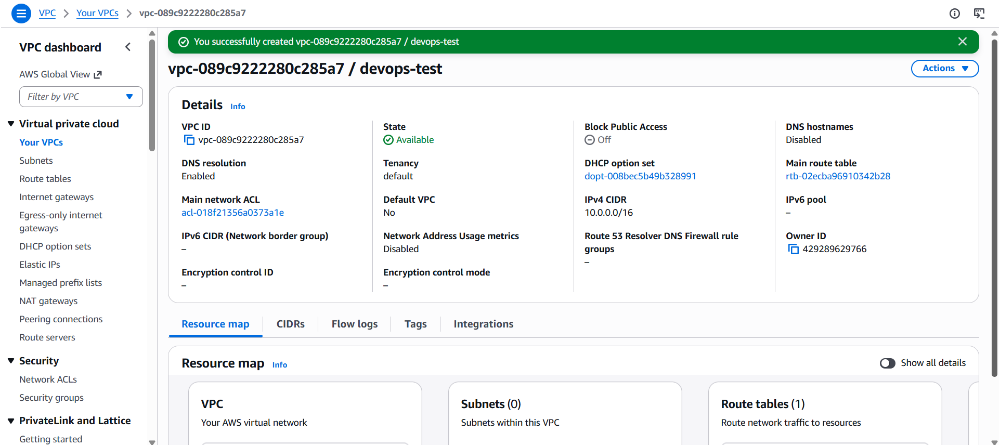
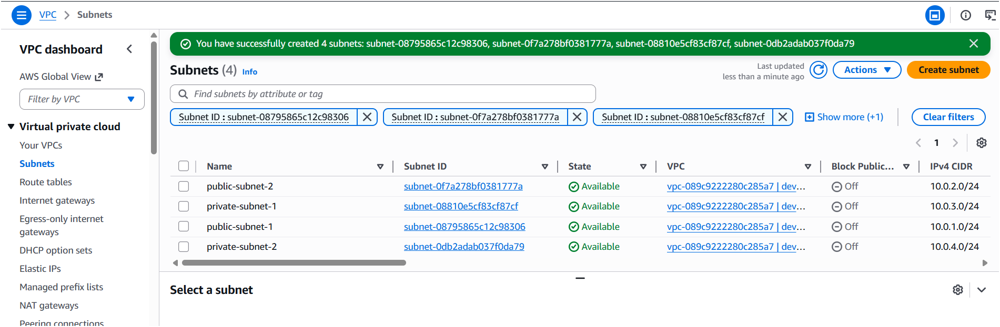
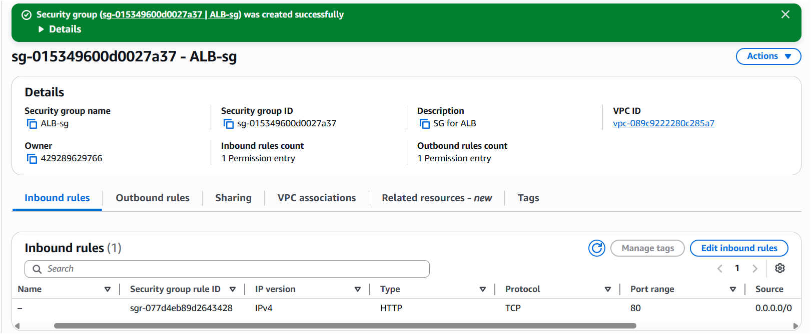
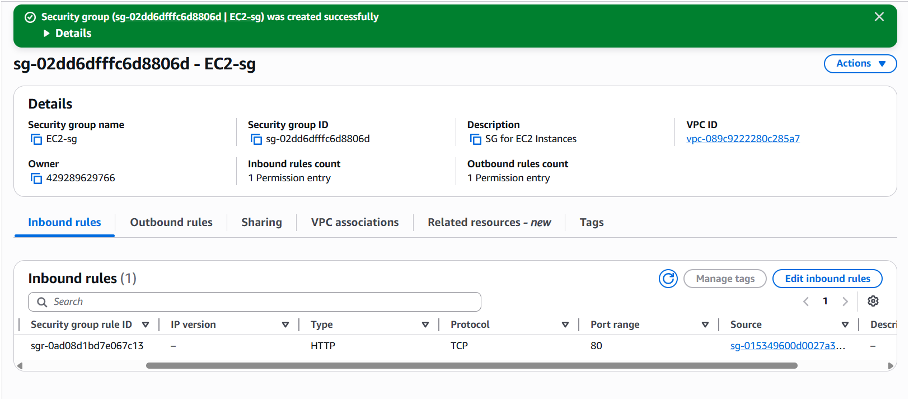
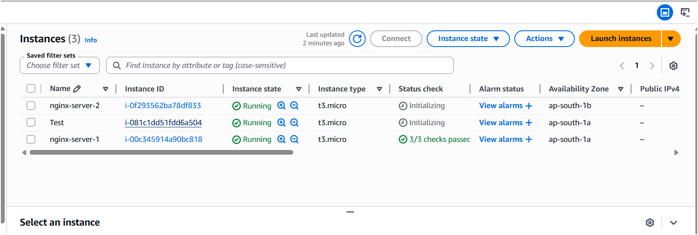
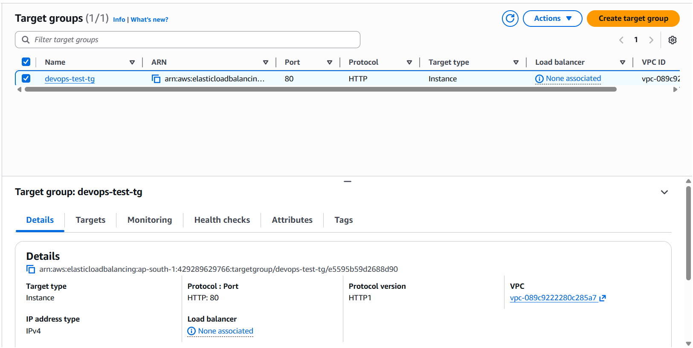
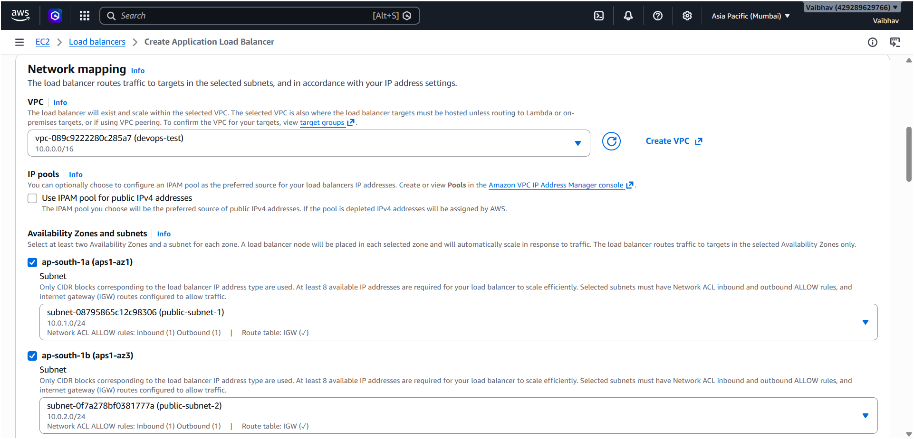
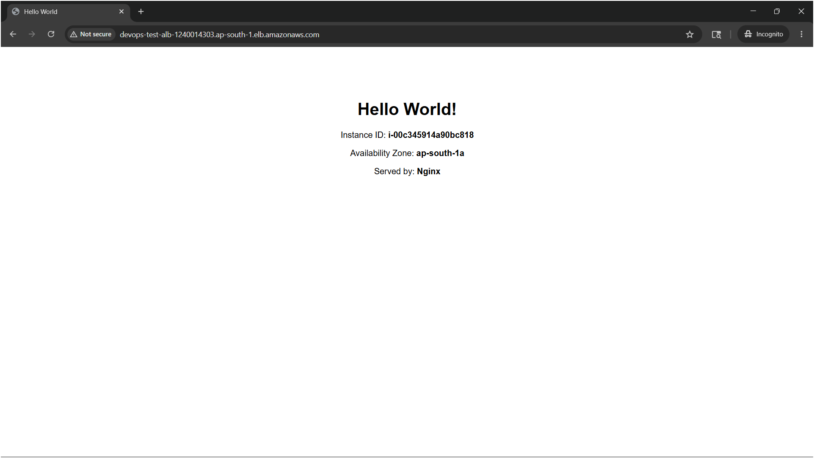

# AWS DevOps Technical Assessment

## Project Overview

This project demonstrates deployment of a secure and highly available web application architecture on AWS.

## Project Highlights

- Secure VPC Architecture
- Public and Private Subnets
- Bastion Host for Secure SSH Access
- Application Load Balancer
- EC2 Instances in Private Subnets
- NAT Gateway for Outbound Access
- Nginx Web Server
- Security Group Based Access Control
- Multi-AZ High Availability

## Architecture Diagram


## Architecture Flow

Internet → Application Load Balancer → Target Group → EC2 Instances


## AWS Services Used

- Amazon VPC
- EC2
- Application Load Balancer
- Target Groups
- NAT Gateway
- Internet Gateway
- Route Tables
- Security Groups
- Nginx

## VPC Configuration
| Component | Configuration |
|---|---|
| VPC CIDR | 10.0.0.0/16 |
| Public Subnet 1 | 10.0.1.0/24 |
| Public Subnet 2 | 10.0.2.0/24 |
| Private Subnet 1 | 10.0.3.0/24 |
| Private Subnet 2 | 10.0.4.0/24 |


## Security Design

- The Application Load Balancer is deployed in public subnets
- EC2 instances are deployed in private subnets
- EC2 instances do not have direct public internet access
- Security Groups allow HTTP traffic only from the ALB to EC2 instances
- NAT Gateways provide outbound internet access for private instances

## EC2 Configuration
| Instance | Availability Zone | Web Server |
|---|---|---|
| nginx-server-1 | ap-south-1a | Nginx |
| nginx-server-2 | ap-south-1b | Nginx |

## Bastion Host Configuration

A temporary bastion host (jump server) was deployed in the public subnet to securely access EC2 instances located in private subnets.

Process followed:
- SSH access was temporarily enabled for the bastion host
- The PEM key was securely copied to the bastion instance
- Private EC2 instances were accessed through the bastion host
- Nginx installation and configuration were completed on private instances
- SSH access was removed from the security group after setup completion

This approach improves security by avoiding direct public SSH access to private EC2 instances.


## Application Load Balancer
- Internet-facing ALB
- Listener: HTTP Port 80
- Integrated with Target Group
- Distributes traffic across multiple EC2 instances

## Target Group Health Checks

The target group performs health checks to ensure traffic is routed only to healthy EC2 instances.

## Nginx Installation Commands
```bash
sudo apt update
sudo apt install nginx -y
sudo systemctl start nginx
sudo systemctl enable nginx
```

## Testing and Validation
- Verified successful access through ALB DNS endpoint
- Verified load balancing across multiple EC2 instances
- Verified health checks status
- Verified secure communication through security groups

## Load Balancer URL
http://devops-test-alb-1240014303.ap-south-1.elb.amazonaws.com/

## Screenshots
### VPC Configuration


### Subnets


### Security Groups



### EC2 Instances


### Target Group  


### Application Load Balancer


### Final Webpage



## Automation Using User Data Script

A user-data script was used to automate:
- Nginx installation
- Webpage deployment
- EC2 metadata display

The script dynamically displays:
- Instance ID
- Availability Zone

## Conclusion

This project demonstrates deployment of a secure, scalable, and highly available AWS infrastructure using industry-standard cloud and DevOps practices.

## Author

Vaibhav Jadhav
